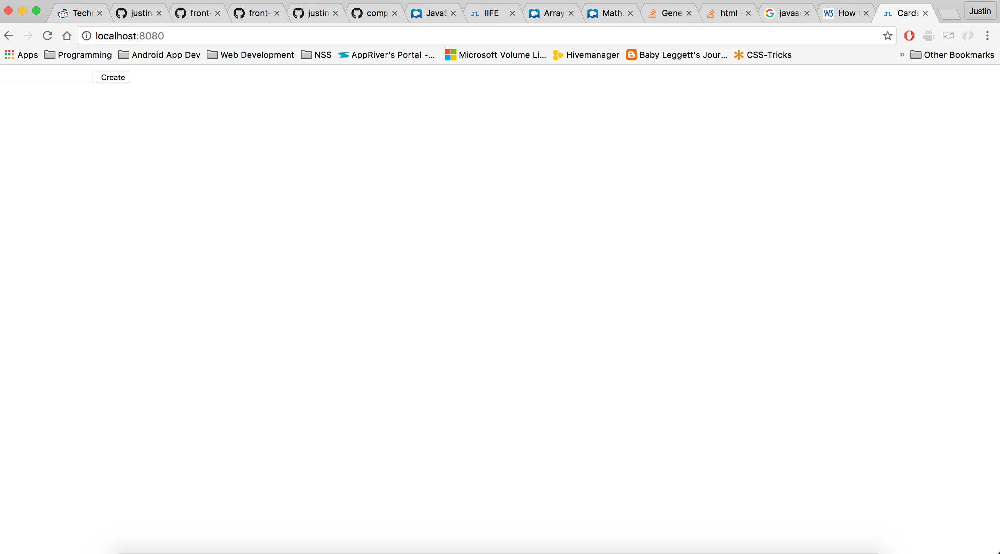
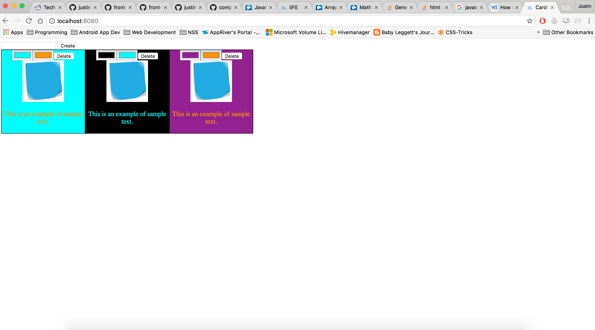
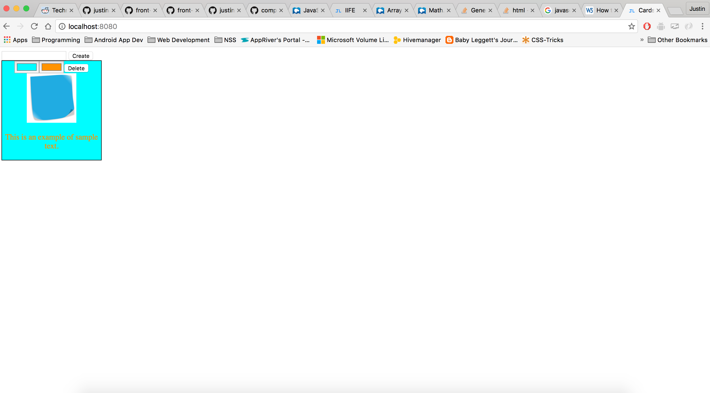

#Cards


## Description
The user is given an input field and a button. When the user clicks the button a dom element(card) will appear with 2 color inputs and a delete button and a sample image. Using the color inputs the user can change the color of the font and the background. Once the user clicks delete the card is removed from the dom. In this exercise I learned how to create EventListeners once an element is created.

## How to run
In your terminal run:
```
http-server -p 9999
```
then navigate to http://localhost:9999 in your browser.

## Screenshots




## Contributors
- [Justin Leggett](https://github.com/justinal64)